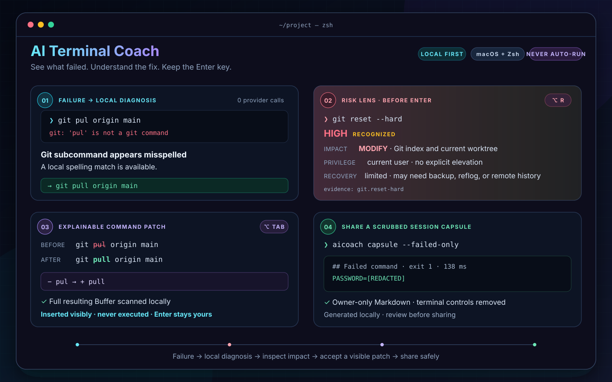

# AI Terminal Coach

[](https://github.com/BlueKiteCoder/ai-terminal-coach/actions/workflows/ci.yml)
[](https://github.com/BlueKiteCoder/ai-terminal-coach/actions/workflows/release.yml)


[](LICENSE)

[English](#english-overview) · [简体中文](#ai-terminal-coach)

**失败 → 本地诊断 → AI 协作 → 安全插入 → 一键分享排障现场。**

AI Terminal Coach 是一个只面向 macOS/Zsh 的终端协作层。它不替代 Terminal，
不截获 Enter，也不自动执行 AI 建议；它通过 ZLE、Zsh hooks、Unix Domain
Socket daemon 和独立 Ratatui 窗口，寄生在现有终端工作流中。

产品方向与可验证的里程碑见 [ROADMAP.md](ROADMAP.md)。



这张演示图由真实的本地分析、安全分级、Source Cards、Command Patch 和隐私脱敏
引擎输出生成，并由 CI 检查，避免文档示例与实际行为悄悄偏离。

```text
Terminal.app / iTerm2 / 其他 macOS 终端
                  │
             Zsh + ZLE hooks
                  │  ~/.aicoach/run/aicoach.sock
                  ▼
              aicoachd
      ┌───────────┼────────────┬────────────┐
 Local Analyzer  Safety     Context    Local Memory
      │            │            │        never uploaded
      └────────────┴────────────┘
                   │ redacted, opt-in
          OpenAI-compatible API
                  │
              aicoach-ui
```

项目不是学习系统：没有评分、课程、复习、能力画像或知识数据库。

## 功能

- `preexec`/`precmd` 捕获命令、退出码、cwd 和耗时；后台异步分析，不阻塞
  Prompt。
- ZLE `Option+Tab` 读取并修改 `BUFFER`/`CURSOR`；用户继续输入会取消旧请求，
  结果只有在 Buffer 未变化时才应用。
- 每次补全都会生成本地 **Command Patch**：显示被删除/新增的 token、AI 给出的修改
  原因，以及对最终完整 Buffer 的风险扫描结果；`insert` 补全不会只检查新增片段。
- 在执行前按 `Option+R` 打开本地 **Risk Lens**：显示命令可能影响的对象、权限需求、
  恢复难度和命中的规则。**Source Cards** 同时引用本机 `man`/受限命令帮助的原文
  摘录，并明确标出哪些结论仍是规则推断；未知命令不会伪装成低风险。
- 在当前输入行写下问题后按 `Option+/`，把该 Buffer 作为问题发送；不会把问题
  当作 Shell 命令执行。
- `Option+Space` 在原终端和独立 Coach TUI 之间切换。
- 本地分析 command-not-found、权限、文件、Git、Docker、网络、编译、SSH、包
  管理器和拼写错误。普通成功命令不调用 AI。
- **Failure Fingerprints** 在本机识别重复失败，并提示上次同类失败之后的下一条成功
  命令。提示明确标记为时间关联而非确定因果；识别、保存和召回均不调用 AI。
- **Environment Drift Lens** 在失败时对比当前状态与本 session 最近一次成功命令：
  工作目录、Python/Conda 环境，以及可安全观察到的 Git 仓库、分支和工作区计数；只在
  本机显示变化，不读取文件内容，也不把对比报告加入 AI 请求。
- 本地 Safety Engine 分级识别 `rm -rf /`、根目录/家目录递归删除、`mkfs`、
  `dd`、`diskutil eraseDisk`、`git reset --hard`、`git clean -fd`、SQL DROP、
  `chmod -R 777`、强制 kill、fork bomb、下载后直接 pipe 到 shell 等。当前行为是
  warn；永远不代替用户执行。
- 每个终端有独立 UUID session，独立维护最近命令、输出摘要、cwd、聊天和活动
  请求。Context 使用字符预算、单命令预算，并按时间淘汰最旧记录；daemon 对断开的
  session 实施一小时 TTL 和 64 个近期 session 的 LRU 上限，仍连接的 session 不淘汰。
- OpenAI-compatible Provider 支持完整回复、SSE streaming、结构化 completion/
  analysis、独立 fast/smart 模型、超时、并发限制、取消和有限瞬态重试。
- 默认对 API 上行内容启用 API key/token/password/Authorization/Cookie/JWT/
  private key/SSH key/敏感环境变量脱敏；可以关闭。
- `aicoach capsule` 把当前终端最近的命令、状态、耗时和已保留的可用输出整理成可分享的
  Markdown。它完全在本机生成、强制脱敏并清除终端控制序列，可一键复制到剪贴板。
- **Session Checkpoints** 可以给当前排障过程命名、记录最终解决方案，并让 Capsule 自动
  聚焦检查点之后的命令；检查点只存在于当前 daemon 内存，且不会加入 AI 请求。
- aicoach data 给出不含正文的完整本地数据清单，并能精确清除单个 session、聊天历史、
  Failure Fingerprints、日志或全部瞬时数据；配置、安装文件和 Keychain 始终单独保留。
- Provider 不可用时 daemon 自动进入 local-only 模式，Zsh 完全正常工作。
- 界面状态、本地分析和 AI 回复支持英文与中文；全新安装默认英文。
- `aicoach onboard` 提供两分钟引导：读取终端实际发送的 Option 按键、拒绝会覆盖
  普通输入的危险绑定、自动校准安全序列，并用干净 Zsh 实例验证每个组件确实可达。

## 系统要求

- macOS 13 或更新版本（Apple Silicon 与 Intel 均可由 Rust 原生构建）
- Zsh 5.8+
- Rust 1.88+（仅源码构建）
- Terminal.app 或 iTerm2 可获得最佳 Coach 窗口体验

核心 Shell 功能只依赖 Zsh，因此 Warp、Alacritty、Kitty、WezTerm 也可使用命令
分析、AI completion 和快捷问答；独立窗口会回退到 Terminal.app。

## 从源码安装

```zsh
cargo build --release --locked
mkdir -p ~/.local/bin
install -m 0755 target/release/aicoach ~/.local/bin/aicoach
install -m 0755 target/release/aicoachd ~/.local/bin/aicoachd
install -m 0755 target/release/aicoach-ui ~/.local/bin/aicoach-ui
if scripts/build-macos-helper.sh target/release/aicoach-hotkey; then
  install -m 0755 target/release/aicoach-hotkey ~/.local/bin/aicoach-hotkey
else
  print '未安装可选全局快捷键 helper；终端内 Option+Space 仍可用。'
fi
export PATH="$HOME/.local/bin:$PATH"
aicoach install
```

请确保 `~/.local/bin` 永久位于 `PATH`（例如在 `.zshrc` 中设置）；全局快捷键 helper
是可选项，缺少 Xcode Command Line Tools 不会影响 daemon、ZLE 或 TUI 核心功能。

`aicoach install` 会：

1. 创建 owner-only 的 `~/.config/aicoach` 与 `~/.aicoach`；
2. 创建默认配置；
3. 复制 Zsh/JXA 集成资源；
4. 首次修改前备份 `~/.zshrc` 为 `~/.zshrc.aicoach.backup`；
5. 幂等地加入一个有边界标记的 source block；
6. 安装 LaunchAgent 并启动 daemon。

重复执行不会重复修改 `.zshrc`。安装后打开新 Zsh，或：

```zsh
source ~/.config/aicoach/aicoach.zsh
```

随后运行两分钟引导。它不会执行你输入或 AI 建议的 Shell 命令，也不会为了校准
快捷键调用 AI：

```zsh
aicoach onboard
```

## API Provider、语言与密钥

仓库不内置 API endpoint、模型或密钥。默认配置为 `provider = "disabled"`，仅运行
本地分析和安全检查，不会向外部服务发送任何内容：

```toml
[ai]
provider = "disabled"
base_url = ""
api_key_env = "AI_COACH_API_KEY"

[ai.models]
completion = ""
error_analysis = ""
chat = ""

[coach]
language = "en-US"
```

启用兼容服务时，编辑 `~/.config/aicoach/config.toml`，一次性填写服务地址和当前账号
有权使用的三个模型，再将 provider 改为 `openai-compatible`：

```toml
[ai]
provider = "openai-compatible"
base_url = "https://provider.example/v1"

[ai.models]
completion = "your-completion-model"
error_analysis = "your-analysis-model"
chat = "your-chat-model"
```

`base_url` 只是格式示例，不代表默认或推荐服务。项目的界面状态、本地分析和 AI
回复支持英文与中文：`coach.language = "en-US"`（默认）或
`coach.language = "zh-CN"`。例如切换到中文：

```zsh
aicoach config set coach.language zh-CN
aicoach restart
source ~/.config/aicoach/aicoach.zsh
```

切回英文时把 `zh-CN` 改为 `en-US`。新终端会自动读取最新语言设置。

模型必须是当前 key 已授权的模型 ID。服务方通常提供接口或控制台列出授权模型。
推荐把 key 放进 macOS Keychain，避免写进 `.zshrc`、TOML 或 shell history：

```zsh
aicoach config set-key
aicoach restart
```

命令会让 `/usr/bin/security` 在终端中安全读取密钥；值不会进入命令行参数、项目
文件或日志。删除：

```zsh
aicoach config delete-key
```

删除命令会自动刷新正在运行的 daemon，确保旧进程不继续持有该凭据。

临时运行也可使用环境变量。为避免密钥进入 shell history，先关闭当前命令的历史
记录，再在交互提示中输入（或使用 Keychain 方案）：

```zsh
read -rs 'AI_COACH_API_KEY?API key: '; print
export AI_COACH_API_KEY
aicoach restart
unset AI_COACH_API_KEY
```

支持 OpenAI、DeepSeek、OpenRouter、Ollama、LM Studio 及其他兼容
`/chat/completions` 服务：修改 `base_url` 和三个模型即可；不校验密钥的本地服务
仍需给 `api_key_env` 设置任意非空占位值。Local-only：

```zsh
aicoach config set ai.provider disabled
aicoach restart
```

## 快捷键

| 位置 | 默认键 | 行为 |
|---|---|---|
| Zsh | `Option+Tab` | AI 补全/纠错/自然语言转命令，只改 Buffer |
| Zsh | `Option+/` | 把当前 Buffer 作为问题发送并清空输入行 |
| Zsh | `Option+R` | 本地检查当前命令的影响、权限和可恢复性；不修改 Buffer |
| Zsh | `Option+Space` | 显示/隐藏 Coach 窗口 |
| TUI | `Esc` | 返回原终端 |
| TUI | `Option+I` | 仅把明确选中的建议插入原终端 Buffer，显示本地安全评级后返回；仍需自行按 Enter |
| TUI | `Option+Y` | 仅复制所选建议并显示本地安全评级；不会执行命令 |
| TUI | `↑/↓` | 选择建议 |
| TUI | `Ctrl+Q` | 退出窗口 |

macOS 终端需将 Option 配置为 Meta/Esc 前缀。若快捷键冲突，可在 source 之前覆盖：

```zsh
typeset -g AICOACH_COMPLETION_KEY=$'\eg'
typeset -g AICOACH_CHAT_KEY=$'\ec'
typeset -g AICOACH_RISK_LENS_KEY=$'\el'
```

不同终端和键盘布局可能为同一个 Option 组合键发送不同字节。不要再靠猜测修改转义
序列：运行 `aicoach onboard`，按提示实际按下 `Option+Tab`、`Option+/` 和
`Option+R`。校准器只接受带 Meta 前缀或安全的 macOS 原生字符，不会把普通的
`r`、`/`、Tab 或 Enter 绑定掉。仅检查现有安装而不读取按键或修改文件：

```zsh
aicoach onboard --check
```

CLI 生成的快捷键、语言和本地开关带有设置版本；打开过的终端会在下一个 Prompt
自动读取变更。`.zshrc` 中 source 之前的显式覆盖仍然优先。

原生 `Tab`、Enter、Ctrl-R、history、Zsh completion 均未替换。集成文件应在
Oh My Zsh、Powerlevel10k/Starship、autosuggestions 和 syntax-highlighting 之后
source；异步消息使用 `zle -I`、`reset-prompt`、`redisplay` 安全重绘。

## 自然语言与补全示例

```text
docker ps --forma  + Option+Tab  → docker ps --format
git pul origin main + Option+Tab → git pull origin main
# 查看8080端口     + Option+Tab  → lsof -i :8080

[AI Coach] Patch: − pul → + pull · Local risk: no known destructive pattern · Why: Fix the Git subcommand spelling
```

结果结构固定为 `replace`、`insert` 或 `suggest`，不解析 Markdown 猜命令。任何
结果都不会自动按 Enter。Command Patch 中“未命中已知破坏性模式”只表示没有触发
当前本地规则，不构成命令安全证明；执行权和最终判断始终属于用户。

## Risk Lens：执行前看清影响

在当前命令仍位于 ZLE 输入行时按 `Option+R`。Risk Lens 完全在本机运行，不需要 API
Key、不调用 AI、不修改 Buffer，也不截获 Enter：

```text
git reset --hard  + Option+R

[AI Coach]: Risk Lens · HIGH · recognized
Impact: modify Git index and current worktree
Privilege: no explicit elevation (current-user scope)
Recovery: limited; may require backup, reflog, or remote history
Evidence: git.reset-hard
Local source: git reset -h · --hard — reset HEAD, index and working tree
Inference boundary: risk and recovery combine the cited local docs with command profiles/rules
```

它为 Git、文件操作、macOS `defaults`/`diskutil`/`launchctl`、Homebrew、常见包管理器、
Docker 和 Kubernetes 提供本地命令画像，并叠加 Safety Engine 的破坏性规则。覆盖不完整
时显示 `partial coverage`；无法识别的内部工具或脚本显示 `UNRATED`。这是一份影响提示，
不是沙箱、权限模拟器或安全证明。

Source Cards 不联网，也不把手册内容发给 Provider。Git 帮助只调用硬编码的 Apple
`/usr/bin/git` 和已识别子命令；其他来源通过 `/usr/bin/man` 读取白名单页面。两者都有
800ms 超时、512KiB 输出上限、终端控制字符清理和 64 项进程内缓存。没有找到匹配
摘录时，界面会明确显示结论来自本地命令画像/规则推断，而不是编造文档依据。

## Coach 窗口

`aicoach-ui` 是纯 Ratatui/Crossterm 应用，不包含浏览器、Web server、Electron、
Tauri、React 或 Vue。它自动挂到最近聚焦的 shell session，展示 cwd、最近命令、
错误提示、建议和 streaming 对话。Chat history 默认每 session 保留 50 条，可关闭。

每条建议旁都会先显示本地 Risk Lens 徽标，例如 `[LOW]`、`[HIGH/PARTIAL]` 或
`[UNRATED]`；未识别和部分识别不会被伪装成低风险。`Option+I` 是 **insert only**：
daemon 会对真正交给 ZLE 的完整命令重新评级，原终端随后显示“尚未执行”的回执，用户
检查后仍需亲自按 Enter。`Option+Y` 是 **copy only**：只更新 macOS 剪贴板并在 Coach
内显示评级回执。关闭破坏性规则时，徽标和回执会明确显示 `RULES OFF`。

Terminal.app/iTerm2 的窗口由 JXA (`osascript -l JavaScript`) 控制。用户可拖动、
缩放；位置与尺寸保存在 owner-only 的 `~/.aicoach/window-state.json` 并在下次
切换时恢复。仓库还包含 Swift/Carbon 全局 `Option+Space` helper；构建脚本在
Swift 不可用时会回退到 Objective-C/AppKit 实现，ZLE 内的快捷键不依赖 helper。

## Session Capsule：一键分享排障现场

当命令在本机失败、需要提交 GitHub Issue 或向同事求助时，不必手工复制散落的命令
和输出：

```zsh
# 输出最近 20 条命令的 Markdown
aicoach capsule

# 只保留失败命令，并复制到 macOS 剪贴板
aicoach capsule --failed-only --copy

# 将最近 30 条命令写入 owner-only 文件
aicoach capsule --last 30 --output incident.md
```

Capsule 直接读取 daemon 已经保留的有界 session context，不会发起 AI 请求，也不会
额外扫描 Terminal history。因为结果通常会离开本机，它始终启用密钥脱敏——即使
`privacy.redaction` 被关闭；同时把当前用户主目录替换为 `~`、移除 ANSI/OSC 等终端
控制序列，并用动态 Markdown fence 包住不可信输出。脱敏属于防御性 best effort，
公开分享前仍应人工检查。

## Session Checkpoints：把排障过程变成可复用答案

开始处理一个具体问题时创建检查点；解决后不带参数运行 `resolve`，会在 Shell history
之外读取最终说明。之后生成的 Capsule 会自动省略检查点之前的命令，并加入强制脱敏的
最终解决方案。

```zsh
aicoach checkpoint start "Intel build regression"
# ...继续正常排查...
aicoach checkpoint resolve       # 交互输入，不进入 Shell history
aicoach checkpoint status
aicoach checkpoint status --json
aicoach capsule --output incident.md
aicoach checkpoint clear
```

也可以用 `aicoach checkpoint resolve "Pinned the SDK and reran tests"` 直接记录，但参数会
进入常规 Shell history。名称与解决方案分别限制为 120/2000 字符并移除终端控制序列。
检查点按终端 session 隔离，只保存在 daemon 内存；重启 daemon 或 session 淘汰后消失，
不会写入 Failure Fingerprints，也不会进入 completion、analysis 或 chat provider prompt。
Capsule 导出时仍会强制执行密钥、主目录和自定义隐私规则脱敏。

## 本地数据控制中心

aicoach data 只读取路径、字节数、条目数、保留上限和布尔状态，不打印命令、输出、
目录、环境变量值、检查点文字或聊天正文，也不会读取 Keychain 中的密钥值。

~~~zsh
aicoach data
aicoach data status --json
aicoach data sessions
aicoach data sessions --json

aicoach data clear session                 # 当前终端 session
aicoach data clear session --session UUID  # 指定 session
aicoach data clear history
aicoach data clear fingerprints
aicoach data clear logs
aicoach data clear all
~~~

clear session 会清除该 session 的命令/输出摘要、daemon 与 TUI 聊天、允许列表环境快照、
Session Checkpoint、Environment Drift 基线、待关联失败和活跃 AI 请求，但保留正在使用的
Shell 连接；清理命令自身也不会重新写回上下文。clear history 只清聊天，clear all
还会清除所有 daemon 瞬时数据、Failure Fingerprints、日志、窗口状态和运行标记。
单独清理 fingerprints 或 logs 不会重启 daemon，也不会顺带丢失 session 上下文。

所有 clear 操作都保留 config.toml、安装支持文件、~/.zshrc.aicoach.backup 和 macOS
Keychain 凭据；Keychain 仍需显式运行 aicoach config delete-key 删除。按 session 清理时，
已损坏或异常过大的 history.json 不会被覆盖或部分改写。正在打开的 Coach 窗口会收到
清理事件，丢弃其内存中的旧聊天，避免退出时把已经删除的内容重新保存。

## Failure Fingerprints：越用越懂当前这台 Mac

当一条命令失败后，daemon 会在当前 session 内等待下一条非观察型成功命令；同一失败
以后再次出现时，Coach 会显示“上次出现后，下一条成功命令是……”。它不会声称该命令
一定是修复原因。召回命令在进入 Coach 建议列表时仍会经过本地 Risk Lens，仍然只允许
用户检查、插入或复制，绝不自动执行。

持久化文件是 owner-only 的 `~/.aicoach/failure-memory.json`。它默认最多保留 128 条、
30 天，只包含失败形状的 SHA-256、可执行程序族、次数、时间和强制脱敏后的成功后续
命令；**不保存失败命令、stdout/stderr、cwd 或 session ID**，也不把这些长期记忆加入
AI 请求。即使 `privacy.redaction = false`，此处的内置密钥脱敏仍然开启，且继续应用
`privacy.extra_patterns`。脱敏是防御性 best effort，无法理解所有业务敏感字符串；可用
自定义规则补充，并随时通过下面的命令审查或清空。

```zsh
aicoach memory status          # 数据边界、数量、路径与保留策略
aicoach memory list            # 查看全部已脱敏记录
aicoach memory list --json
aicoach memory clear           # 删除全部记录；必要时安全重启 daemon
```

## Environment Drift Lens：先问“环境变了什么”

同一条命令昨天成功、今天失败，问题经常不在命令本身，而在运行环境。每次成功命令后，
daemon 会在内存中保留一个有界快照；下一次命令失败时，它只显示发生变化的项目：cwd、
`VIRTUAL_ENV`、`CONDA_DEFAULT_ENV`，以及 Git 仓库根目录、分支、detached HEAD 和
modified/staged/untracked/conflict/ahead/behind 计数。没有变化就保持安静。

这个 Lens 不读取仓库文件内容，不保存命令输出，也不声称变化就是失败原因。基线仅属于
当前 daemon session，不写入 Failure Fingerprints 文件；Git 探针超时或尚未完成时会省略
该项，不会猜测结果。对比报告只发给当前终端/Coach 界面，不会加入 provider prompt。

## 配置

配置文件：`~/.config/aicoach/config.toml`。

```zsh
aicoach config show
aicoach config path
aicoach config validate
aicoach config set privacy.redaction false
aicoach config edit
```

Daemon 在启动时读取配置，修改 AI、隐私、上下文或 Coach 设置后请执行
`aicoach restart`。快捷键、语言和 Shell 本地开关由生成的 Zsh 设置加载，并在现有
终端的下一个 Prompt 自动刷新；升级旧版 Shell 集成后只需新开一个终端标签页。

主要默认值见 [`config/default.toml`](config/default.toml)。上下文边界：

```toml
[context]
max_commands = 30
max_output_per_command = 20000
max_total_chars = 100000

[memory]
enabled = true
max_entries = 128
retention_days = 30
resolution_window_minutes = 10
```

Daemon 不把完整 Terminal history 持久化；Session Checkpoints 和 Environment Drift 基线
只存在于 daemon 内存，Failure Fingerprints 的例外边界如上所述且可完整查看和删除。
日志只记录请求类型、session/request ID、状态和错误种类，不记录命令输出、提示词、
API key 或响应正文。

## CLI

```text
aicoach install [--no-start] [--no-hotkey]
aicoach onboard [--check] [--skip-shortcuts]
aicoach uninstall [--purge]
aicoach start | stop | restart | status [--json]
aicoach doctor [--json]
aicoach config show|path|validate|set|edit|set-key|delete-key
aicoach logs [-n 100] [--follow]
aicoach capsule [--last 20] [--failed-only] [--copy] [--output FILE]
aicoach checkpoint [--session UUID] [start NAME | resolve [RESOLUTION] | status [--json] | clear]
aicoach data [status [--json] | sessions [--json] | clear session|history|fingerprints|logs|all]
aicoach memory [status [--json] | list [--json] | clear]
aicoach toggle [--session UUID] [--tty /dev/ttys001]
```

`uninstall` 保留配置、Failure Fingerprints 和日志；只有显式 `--purge` 才删除它们，
`.zshrc` 备份始终保留。也可以只用 `aicoach memory clear` 删除 Failure Fingerprints。

## macOS 权限

- Terminal.app/iTerm2 弹出/聚焦：首次使用可能需要在“系统设置 → 隐私与安全性 →
  自动化”允许调用 Terminal/iTerm2。
- JXA 查询前台窗口或可选全局 helper 可能需要“辅助功能”。拒绝权限不会影响 Shell
  hooks、IPC 或 AI completion，只影响窗口切换。
- Keychain：首次由 daemon wrapper 读取时 macOS 可能要求允许访问。不要选择允许
  未知二进制访问。

## 诊断与故障排查

```zsh
aicoach doctor
aicoach onboard --check
aicoach status
aicoach logs -n 200
```

- `AI credential ... is not set`：运行 `aicoach config set-key`。
- `doctor` 默认是无网络诊断：它验证 Provider 配置和凭据是否就绪，但不会把终端
  上下文发送到服务或主动探测模型；实际授权模型/网络状态在首次 AI 请求时确认。
- AI 返回模型不存在：登录 Provider 查看当前 key 的授权模型，修改 `ai.models.*`。
- `Option+…` 产生特殊字符：启用终端的 “Use Option as Meta key”。
- 不确定终端发送了什么：运行 `aicoach onboard` 进行实际按键校准；支持 `Esc` 跳过
  单项，`Ctrl+C` 安全退出。
- `Option+Space` 被系统/其他应用占用：更换绑定或只使用终端局部快捷键。
- API timeout：Shell 不会等待；completion 默认 2.5 秒，analysis 12 秒，chat 90 秒。
- 交互程序（vim/ssh/python 等）：hook 只看到程序启动和最终退出，不截获内部按键。

## Homebrew

在首个签名、公证的公开 Release 和独立 tap 上线前，项目不宣称存在可用的稳定
Homebrew 安装入口；请使用上面的“从源码安装”。
[`homebrew/aicoach.rb`](homebrew/aicoach.rb) 是供维护者在临时 tap 中验证的 HEAD-only
开发 Formula，而 Homebrew 6 已不接受直接从任意本地路径安装 Formula。

维护者可这样测试：

```zsh
brew tap-new --no-git BlueKiteCoder/aicoach-dev
install -m 0644 homebrew/aicoach.rb \
  "$(brew --repository BlueKiteCoder/aicoach-dev)/Formula/aicoach.rb"
brew install --HEAD BlueKiteCoder/aicoach-dev/aicoach
```

Formula 会先在有网络的 `fetch` 阶段缓存锁定依赖，再在无网络的安装阶段构建。生成的
LaunchAgent 使用 Homebrew 的稳定 `bin` 链接，因此正常 `brew upgrade` 不再要求重新
运行 `aicoach install`。源码安装到 `~/.local/bin` 的行为保持不变。

测试完可运行 `brew untap BlueKiteCoder/aicoach-dev` 移除临时 tap。首个正式版本发布
后，将创建 `BlueKiteCoder/homebrew-aicoach`，填入不可变 tag 源码的
真实 SHA-256（Release 流水线会生成并证明 `aicoach.rb` 资产），再在 Apple Silicon 与
Intel 上验证安装、升级和卸载；在此之前不把 tap 写成已经可用。完整发布流程见
[`docs/RELEASING.md`](docs/RELEASING.md)。

## 开发、测试与发布

```zsh
cargo fmt --all -- --check
cargo clippy --workspace --all-targets -- -D warnings
cargo test --workspace --locked
cargo run --locked -p aicoach-core --example render_demo -- --check docs/assets/workflow.svg
zsh scripts/test-zsh-integration.zsh
zsh scripts/test-onboarding-e2e.zsh
zsh scripts/benchmark-zsh-hooks.zsh
cargo build --release --locked
AICOACH_REQUIRE_HOTKEY=1 scripts/package-release.sh 0.1.0
scripts/verify-release-tag.sh v0.1.0
```

测试覆盖 analyzer、safety、privacy、context、Git context、AI 合法/非法/缺字段
JSON、timeout/cancel/retry/SSE、Unix socket、连接断开、多 session、请求取消、Zsh
编码与 Buffer/CURSOR 修改。Onboarding E2E 在隔离的临时 HOME 和伪终端内发送真实
Meta 字节，验证校准、落盘与 Zsh widget 绑定。性能脚本实测 source、preexec、precmd，
并强制本地 hook 平均耗时低于 10ms。AI tests 使用本地 TCP mock，不调用真实 Provider。
演示图不是手工绘制的静态截图；修改相关引擎行为后可运行
`cargo run --locked -p aicoach-core --example render_demo -- docs/assets/workflow.svg`
重新生成，CI 会拒绝过期的演示内容。

## 性能预算

`scripts/benchmark-product.zsh` 实测 Zsh integration 加载、同步 `preexec`/`precmd`、
三个 release 可执行文件的启动中位数与合计体积。任一指标超过公开预算都会让 CI 失败；
`--markdown` 生成 GitHub Job Summary，`--json` 可供外部工具读取。当前主分支和双架构
测量入口、方法与噪声边界见 [Performance Budgets](docs/PERFORMANCE.md)。

## 目录与架构

```text
crates/aicoach-core     配置、领域模型、本地分析、安全、隐私、上下文、Git
crates/aicoach-ai       Provider trait、OpenAI-compatible JSON/SSE client
crates/aicoach-ipc      NDJSON + Zsh tab/percent-encoded Unix socket protocol
crates/aicoach-daemon   session/request 管理、异步编排、屏幕尾部降级采集
crates/aicoach-cli      安装、LaunchAgent、配置、doctor、日志、窗口命令
crates/aicoach-tui      独立 Ratatui Coach
shell/                  ZLE widgets 与 hooks
macos/                  可选 Carbon 全局快捷键 helper
homebrew/               Formula 模板
```

贡献者可以从 [架构与模块边界](docs/ARCHITECTURE.md) 开始，并在修改跨进程消息前阅读
[IPC Protocol v2](docs/PROTOCOL.md)。两份文档包含本地规则、持久化数据、协议操作和
终端适配器的扩展步骤，以及不能被弱化的隐私与执行权约束。

## 已知限制

- macOS Terminal API 没有可靠方式在不代理 PTY 的前提下分别获取每条命令的完整
  stdout/stderr。Shell integration 优先使用显式输出；轻量模式会按 TTY 从
  Terminal.app/iTerm2 异步抓取 screen tail，因此输出分类属于 best effort。此行为
  默认关闭；只有明确接受该隐私边界时才设置
  `privacy.capture_screen_tail = true`，捕获内容仍会先脱敏。
- 当前安全模式只实现 `warn`；它不会拦截 Enter 或阻止用户执行已输入命令。危险的
  AI 补全不会自动写入 Buffer，而是只显示风险提示。
- 全局 Option+Space helper 仍依赖匹配的 macOS Command Line Tools；缺失时仍可在
  Zsh 中切换 Coach。
- Warp 等终端的 Shell 功能可用，但专用窗口定位/恢复仅对 Terminal.app/iTerm2
  做了深度适配。
- 为避免意外收集 secret，本项目不快照任意环境变量；只维护一组与终端体验有关的
  非敏感 allowlist（locale、`TERM`/`COLORTERM` 和虚拟环境元数据），并在每次命令
  完成时更新。
- 当前 Formula 只支持显式 `--HEAD` 源码安装；稳定 tap 必须等首个公开 tag 和真实
  源码 SHA-256 后才能发布。
- `package-release.sh` 生成当前机器架构、可复现但仅 ad-hoc 签名的本地测试包。公开
  流水线会分别原生构建 `arm64`/`x86_64`，并且缺少 Developer ID 或 Apple 公证凭据
  时拒绝发布；当前尚无正式 Release，因此不把本地包宣称为最终下载包。

## 卸载

```zsh
aicoach uninstall
```

完全清理本地配置、历史与日志：

```zsh
aicoach uninstall --purge
```

## 安全边界

AI 不代替终端，也不代替用户执行命令。即使建议来自结构化响应，最终也只能进入
可见的 ZLE Buffer。执行权始终由用户保留。

## 许可

本项目使用 [MIT License](LICENSE) 开源。贡献指南见
[CONTRIBUTING.md](CONTRIBUTING.md)，工程入口见
[Architecture](docs/ARCHITECTURE.md)、[IPC Protocol](docs/PROTOCOL.md) 与
[Performance Budgets](docs/PERFORMANCE.md)。

## English overview

AI Terminal Coach is a macOS/Zsh companion that provides local diagnostics,
safety warnings, a provider-free preflight Risk Lens, explainable token-level
Command Patches, local-manual Source Cards, AI-assisted completion, quick
terminal chat, share-ready privacy-scrubbed Session Capsules, local-only Failure
Fingerprints, memory-only Session Checkpoints, a provider-free Environment Drift
Lens, and a standalone Ratatui Coach window. It never presses Enter or executes
an AI suggestion.

The workflow image above is generated from the real local analyzer, Risk Lens,
Source Card, Command Patch, and privacy-redaction output. CI verifies the
committed asset so the demonstration cannot silently drift away from product
behavior.

The repository ships with no API endpoint, model ID, or API key. The default
provider is disabled, screen-tail capture is opt-in, and the application runs
in local-only mode until the user explicitly configures an OpenAI-compatible
provider. Interface messages, local analysis, and AI responses support English
(`en-US`, the default) and Simplified Chinese (`zh-CN`).

Failure Fingerprints retain at most 128 entries for 30 days by default. The
owner-only store contains a hash of the normalized failure shape and the
always-redacted next successful command—never the failed command, diagnostic
output, cwd, or session ID. It is never added to provider prompts and can be
inspected or removed with `aicoach memory list` / `aicoach memory clear`.
Redaction is defensive best effort; `privacy.extra_patterns` also applies to
this store when project-specific strings need additional coverage.

Environment Drift Lens compares only the current failure with the latest success
in the same daemon session. It reports changed cwd, Python/Conda activation and
bounded Git metadata. The baseline is memory-only, file contents are not read,
incomplete Git probes are omitted, and the comparison is never added to an AI
provider request.

Session Checkpoints name one bounded troubleshooting interval and attach a final
resolution to its Capsule. Checkpoint metadata is terminal-safe, per-session and
daemon-memory-only; it is removed before completion, analysis, or chat provider
requests. Capsule export focuses on commands after the marker and force-redacts
the resolution before it can leave the machine.

The local data control center inventories every product-managed persistent,
Keychain, runtime, and daemon-memory category using metadata and counts only.
Typed clear scopes can erase one session, chat history, failure fingerprints,
logs, or all transient data. Session clearing cancels active AI work and removes
its own bookkeeping command without disconnecting the live shell; configuration,
support files, the shell backup, and Keychain credentials remain separate.

Build and install:

```zsh
cargo build --release --locked
mkdir -p ~/.local/bin
install -m 0755 target/release/aicoach{,d,-ui} ~/.local/bin/
export PATH="$HOME/.local/bin:$PATH"
aicoach install
aicoach onboard
```

Onboarding captures the physical Option sequences emitted by the current terminal,
refuses unsafe bindings that would replace normal typing, and verifies the generated
widgets in a clean Zsh process. Use `aicoach onboard --check` for a read-only check.
See the Chinese sections above for configuration, shortcuts, privacy boundaries,
troubleshooting, and release requirements. Licensed under the
[MIT License](LICENSE).
